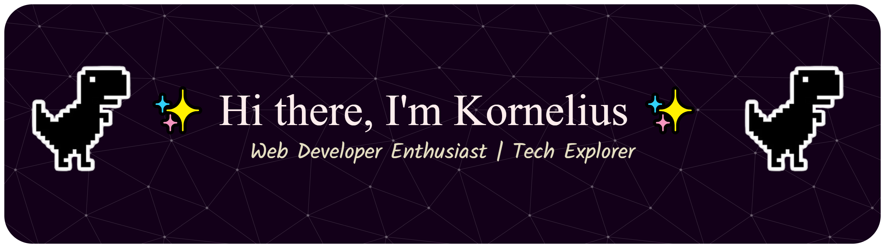

  
  
    
  
  

---

## 👨‍💻 About Me

I'm a passionate developer who loves problem-solving, clean code, and creating amazing web experiences. I believe great code should be both beautiful and functional.

- 🌱 **Currently learning:** Web Development, Flutter, and AI integrations.
- 💼 **Looking for:** Exciting **Tech Internship** opportunities to grow and contribute!

---

## 🛠️ Tech Stack & Tools

  
  
  
  
  
  
  

---

## 📊 GitHub Stats

  
  

---

## 🎮 Pacman Activity

  <picture>
    <source media="(prefers-color-scheme: dark)" srcset="https://raw.githubusercontent.com/kkornelius/kkornelius/output/pacman-contribution-graph-dark.svg">
    <source media="(prefers-color-scheme: light)" srcset="https://raw.githubusercontent.com/kkornelius/kkornelius/output/pacman-contribution-graph.svg">
    
  </picture>

---

## 📫 Let's Connect!

  
  
  
  

  

